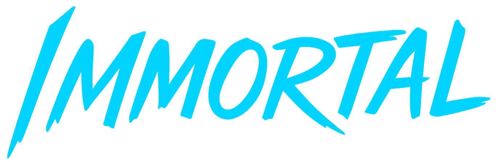
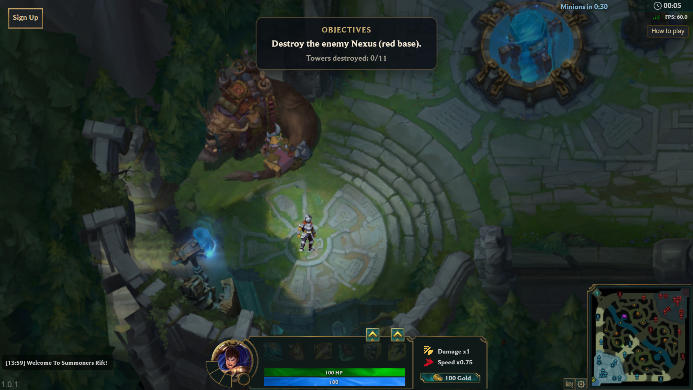
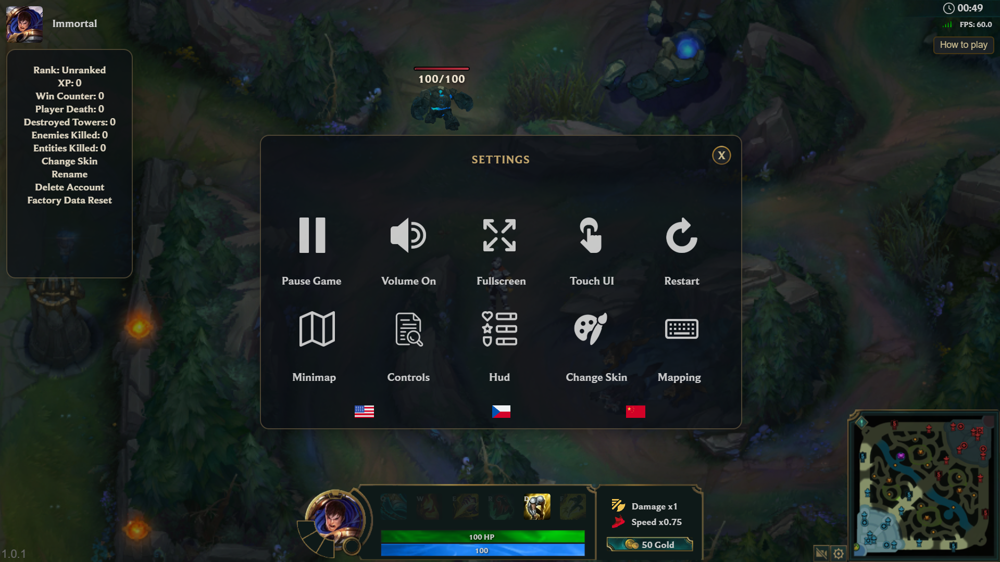
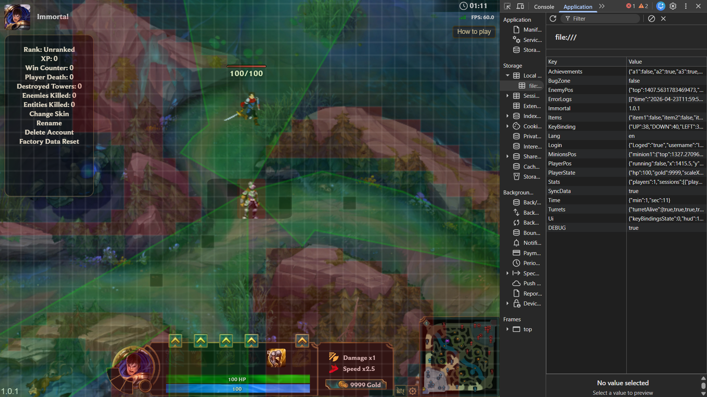
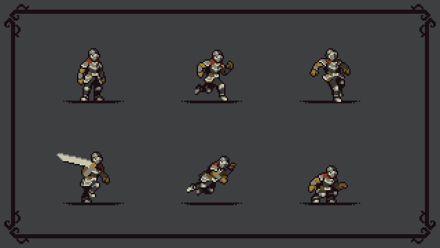
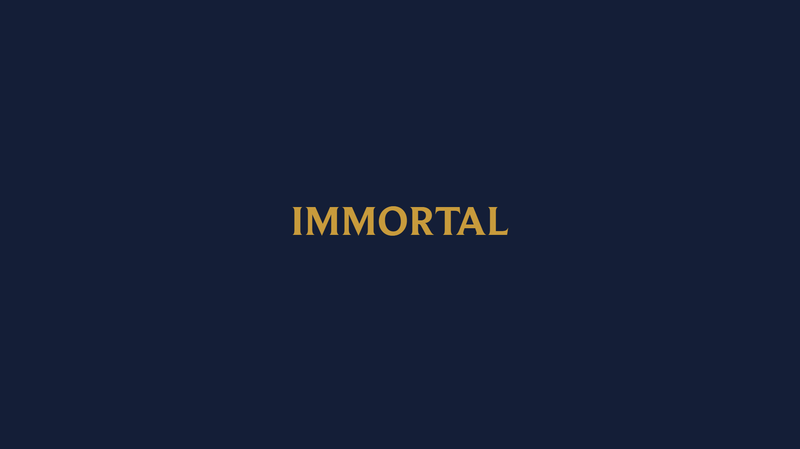

# **Immortal**




## Description
**Immortal** is a 2D remake of [League of Legends](https://www.leagueoflegends.com/). It runs directly in the browser, without installation, and is fully playable on PC, tablets and mobile phones.

## Key Features & Technologies
- 🌐 **Purely web game** - no installation

- 🧠 **Advanced web technologies** – built on modern web capabilities with support for complex systems, background processing, and scalable game logic.

- 📱 **Responsive design** – works on different devices

- 🧱 **Collision map system** – precise movement and collisions

- �️ **Fog of War** – advanced line of sight system with ray casting and entity visibility caching

- 🎯 **Entity visibility** – intelligent hiding of HP bars and entities behind walls

- �💾 **LocalStorage & IndexedDB** – saving player progress with efficient data persistence

- 🎮 **Gamepad support** – full controller support with AntiMicroX integration

- 🌍 **Multi-language** – English, Czech, and Chinese localization support

- 💬 **Chat system** – in-game communication with auto-close functionality

- 🧩 **Modular architecture** – easy expansion with clean separation of concerns

- ⚡ **Highly optimized** – throttled updates, DOM caching, and performance profiling for maximum FPS

- 🎮 **Web MOBA gameplay** – MOBA mechanics adapted for a lightweight 2D format.

- 🚀 **Instant play** – start playing immediately without installing anything.

- 🧑‍💻 **Developer-friendly** – built-in debug tools with collision map visualization, fog of war debug polygon, and performance monitoring.

- 👥 **Community-driven** – open to fans and contributors.

##  Getting Started
You can start the game **directly in your browser** by opening `index.html`.
> For the best experience and to enable all features, running a local server is recommended.

**Requirements:**
- [Python](https://www.python.org/downloads/) must be installed.

**To run a local server:**
```bash
cd Immortal
py server.py
```
Or, from the same folder: `npm start` (runs `py server.py`).
> Running `server.py` will start the server on port 5500.

Open your browser at http://localhost:5500 to start playing or developing.

## Screenshots
<table>
<tr>
  <td></td>
  <td></td>
  <td></td>
</tr>
</table>

## [CREDITS](doc/CREDITS.md)
For all authors, libraries, and assets used in the project.



## 📚 More Information
- [Controls](doc/CONTROLS.md)
- [AntiMicroX](doc/AntiMicroX.md)
- [Developer Guide](doc/developer-guide.md)

## [LICENSE](LICENSE)
This project is licensed under the **MIT License**. See the LICENSE file for more details.

## Legal Notice

This project is a fan-made prototype and is not affiliated with or endorsed by Riot Games.

Some visual assets currently used in the prototype originate from League of Legends and are used strictly as temporary placeholders for demonstration purposes.

All intellectual property rights, including but not limited to characters, designs, artwork, maps, items, and trademarks, belong to Riot Games, Inc.

These assets are not part of the project ownership and must be replaced with original assets before any public release or commercial use.

If requested by Riot Games, the project will be modified or removed to fully respect their intellectual property rights.


