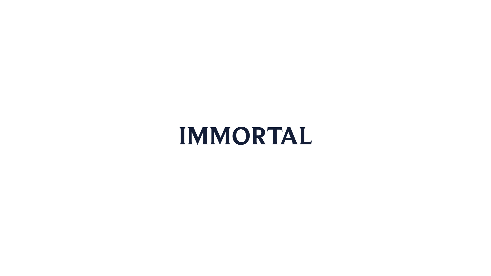

# Credits

#### Heroes:
- Nauris - [@Namatnieks](https://x.com/Namatnieks)
- Luiz Melo - [@LuizGdeMelo](https://x.com/LuizGdeMelo)
- Sven Thole - [@Sven_Thole](https://x.com/Sven_Thole)

#### FX Effects:
- Ragna Pixel Studio - [@ragnapixel](https://ragnapixel.itch.io/)
- Spirit Witch - [@SxWxSGame](https://x.com/sxwxsgame)

#### Game Overlay:
- ScratchBattles - [@squaremeapixel](https://itch.io/profile/squaremeapixel)

**Thank you to all the talented creators** whose images have contributed to this project. We kindly remind everyone using this project to respect the licensing terms and conditions associated with each image and resource.

## Additional Resources
- **[Google Fonts Guide](https://developers.google.com/fonts/docs/getting_started)** - A free library of open-source fonts for web and digital design, easily integrated via CSS.
- **[Flaticon](https://www.flaticon.com/)** – Free icons and UI elements.
- **[Pixabay](https://pixabay.com)** – A free resource offering royalty-free audio tracks, including music and sound effects, for personal and commercial use.

## Utility programs
- **[Tiled](https://www.mapeditor.org/)** – A free and open source tile map editor for creating 2D game maps.
- **[AntiMicroX](https://antimicro.net/)** – Allows you to map gamepad buttons and axes to the keyboard and mouse.
- **[VS Code](https://code.visualstudio.com/)** – Free and clear code editor.

## Libraries
- **[Chart.js](https://www.chartjs.org/)** – A library for creating responsive and customizable charts on websites.
- **[jQuery.js](https://jquery.com/)**– A library that simplifies HTML document manipulation, event handling, animations, and Ajax interactions across browsers.

